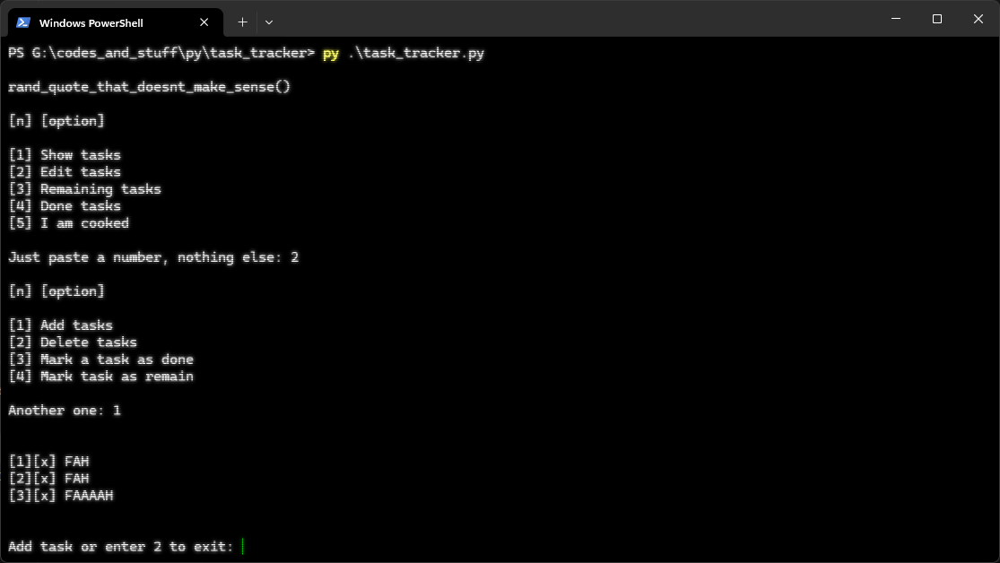

<!-- Improved compatibility of back to top link: See: https://github.com/othneildrew/Best-README-Template/pull/73 -->
<a id="readme-top"></a>
<!--
*** Thanks for checking out the Best-README-Template. If you have a suggestion
*** that would make this better, please fork the repo and create a pull request
*** or simply open an issue with the tag "enhancement".
*** Don't forget to give the project a star!
*** Thanks again! Now go create something AMAZING! :D
-->


<!-- PROJECT SHIELDS -->
<!--
*** I'm using markdown "reference style" links for readability.
*** Reference links are enclosed in brackets [ ] instead of parentheses ( ).
*** See the bottom of this document for the declaration of the reference variables
*** for contributors-url, forks-url, etc. This is an optional, concise syntax you may use.
*** https://www.markdownguide.org/basic-syntax/#reference-style-links
-->
<!-- PROJECT LOGO -->
<br />
<div align="center">
  <a href="https://github.com/ShafayetStuff/task_tracker">
      </a>

<h3 align="center">Task Tracker</h3>

  <p align="center">
      A CLI based task tracker with data storing functionality. Made with Python 3.14.

  </p>
</div>


<!-- TABLE OF CONTENTS -->
<details>
  <summary>Table of Contents</summary>
  <ol>
    <li>
      <a href="#about-the-project">About The Project</a>
    </li>
    <li>
      <a href="#getting-started">Getting Started</a>
      <ul>
        <li><a href="#installation">Installation</a></li>
      </ul>
    </li>
    <li><a href="#usage">Usage</a></li>
    <li><a href="#license">License</a></li>
    <li><a href="#contact">Contact</a></li>
  </ol>
</details>


<!-- ABOUT THE PROJECT -->
## About The Project
<p align="center">
 

A easy to use Task tracker or a to-do list for your tasks. Made with Python. </br> It can store your tasks, edit, mark as done, mark as remaining, and more other stuff at <a href="#usage">usage</a>

<p align="right">(<a href="#readme-top">back to top</a>)</p>


<!-- GETTING STARTED -->
## Getting Started

Easy and peasy. You should have Python installed.

### Installation

1. Clone the repo
   ```sh
   git clone https://github.com/ShafayetStuff/task_tracker
   ```
2. cd into the directory and run
   ```sh
   py .\task_tracker.py
   ```
<p align="right">(<a href="#readme-top">back to top</a>)</p>


<!-- USAGE EXAMPLES -->
## Usage
Easy peasy.

**Task Management System**  
├── Show tasks<br>
├── Edit tasks<br>
│&nbsp;&nbsp;&nbsp;├── Add tasks<br>
│&nbsp;&nbsp;&nbsp;├── Delete tasks<br>
│&nbsp;&nbsp;&nbsp;├── Mark a task as done<br>
│&nbsp;&nbsp;&nbsp;└── Mark task as remain<br>
├── Remaining tasks<br>
└── Done tasks


<p align="right">(<a href="#readme-top">back to top</a>)</p>


<!-- LICENSE -->
## License

No License.

<p align="right">(<a href="#readme-top">back to top</a>)</p>

<!-- CONTACT -->
## Contact

Shafayet Islam Ifaz - [wndr16 (Instagram)](https://www.instagram.com/nebulaa.006/) - w0ndered@proton.me

Project Link: [https://roadmap.sh/projects/task-tracker](https://roadmap.sh/projects/task-tracker)

<p align="right">(<a href="#readme-top">back to top</a>)</p>
